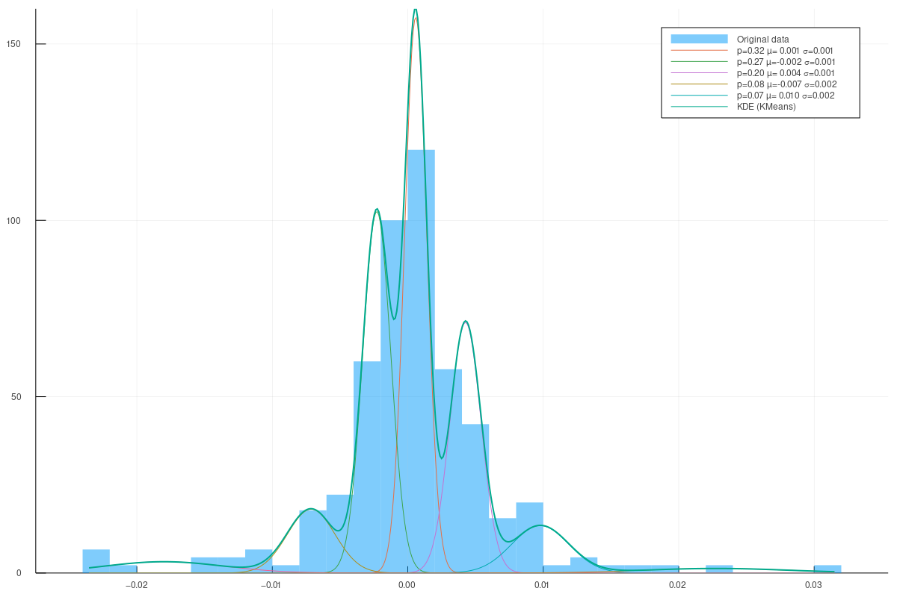
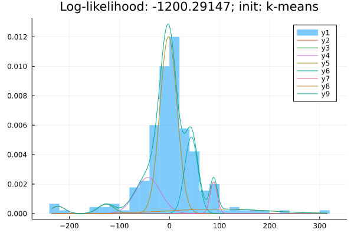
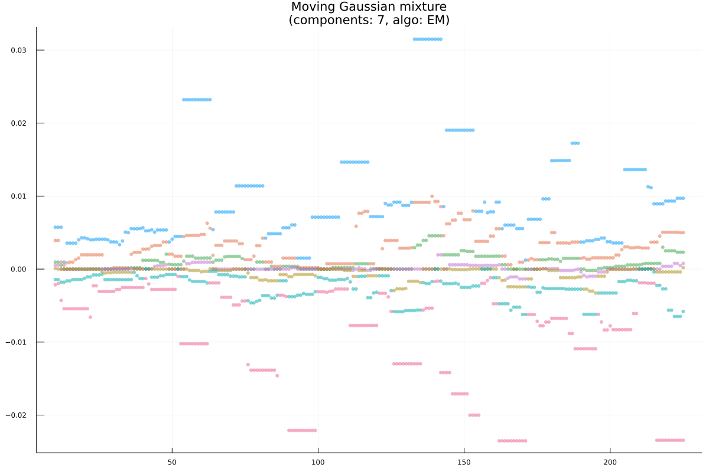
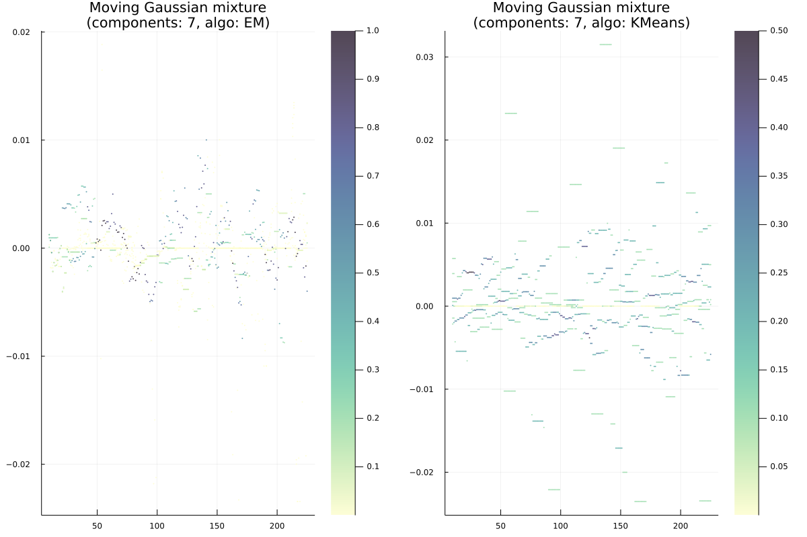

# MovingGaussianMixtures.jl

Estimate 1D finite Gaussian mixture models in Julia.

## Functions

### Static estimation

- `kmeans(x::AbstractVector, k::Integer, n_steps::Unsigned=UInt(20); kwargs...)` - fit mixture model with `k` components using k-means.
- `em(x::AbstractVector, k::Integer; kwargs...)` - fit mixture model with `k` components using EM (Expectation Maximization) algorithm.

`kmeans` and `em` propagate their keyword arguments to `kmeans!` and `em!` respectively. Both return structure `GaussianMixtureEstimate{k, T <: Real}`, where `k` is the number of components.

### Dynamic estimation

- `em(x::AbstractVector{T}, k::UInt, win_size::UInt; step_size::UInt=UInt(5), verbose::Integer=1000, kwargs...)` - fit mixture model with `k` components on each subinterval of length `win_size`. Each new window is shified forward by `step_size` elements of `x`. Like rolling mean or rolling standard deviation, but with EM.

### Plotting

`kmeans` and `em` return data that can be plotted with Plots.jl, namely, with `plot` and `scatter` (the latter is for dynamic estimation only).

## Example

For code, see [tests](test/).

### Estimation with k-means

### Estimation with EM

### Dynamic estimation

Colors represent ID of component:

Colors represent weights of components:

