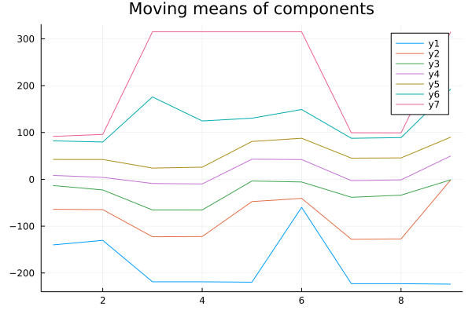

# MovingGaussianMixtures.jl

Estimate 1D finite Gaussian mixture models in Julia.

## Functions

The interface is similar to that of SciKit-Learn. To fit, for example, a Gaussian mixture model (GMM) to data, create a `GaussianMixture` and call `fit!` on it and the data.

- `GaussianMixture(K, N; warm_start=false)` represents a Gaussian mixture model with `K` components that will be fit on data of length `N`.
- `MovingGaussianMixture(K, win_size, step_size; warm_start=false)` represents a series of Gaussian mixtures with `K` components each fit on rolling windows of length `win_size` of the data.
- `KMeans(K, N; warm_start=false)` represents the state of the `K`-means algorithm used to initialize the means of the GMM.

Each model is fit using the `fit!` method. For example:

```julia
my_data = rand(200)

# Gaussian mixture model with 5 components
# whose `fit!` method expects data of length 100
gm = GaussianMixture(5, 100)

fit!(gm, my_data[1:100])
```

## Results

The results are available after a call like `fit!(model, my_data)`.

- Call the `distribution` method on a fitted `GaussianMixture` to obtain the `Distributions.jl` `UnivariateGMM` object corresponding to the fitted model.
- Call the `params` method on a fitted `MovingGaussianMixture` to obtain a struct with fields:
    - `range` - the indices of `my_data` to which each mixture corresponds
    - `K` - number of components in each mixture
    - `P`, `M` and `Σ` - `K x N` matrices; each _column_ holds the weights `p`, means `μ` and standard deviations `σ` of a mixture model fitted on the corresponding window of `my_data`

### Convergence monitoring

- Call `nconverged(model)` to see how many mixtures converged
    - Returns `0` or `1` for `GaussianMixture`, since there's only one mixture
    - Returns an integer between `0` and the number of windows for `MovingGaussianMixture`
- Call `converged_pct(model)` to see the _percentage_ of converged mixtures
    - Returns `0.0` or `100.0` for `GaussianMixture`, since there's only one mixture
    - Returns a float in range `[0.0, 100.0]` for `MovingGaussianMixture`
- Check `model.converged` to see which windows converged or failed to converge
- Check `model.n_iter` for the number of iterations till convergence

### Saving

The `params` of the fitted `MovingGaussianMixture`, along with other information, can be stored in a `TypedTables.jl` table, which can later be written to a database (using, for example `SQLite.jl`), a CSV file (with `CSV.jl`), etc.

To create the table, call the `to_table` function:

```julia
const N_COMPONENTS = 4
const WINDOW_SIZE = 300
const STEP_SIZE = 1

moving_mixture = MovingGaussianMixture(N_COMPONENTS, WINDOW_SIZE, STEP_SIZE)
fit!(moving_mixture, my_data)

moving_mixture_parameters = params(moving_mixture)
result_table = to_table(moving_mixture_parameters, "my_series_name")

# Or provide your own timestamps:
@assert size(timestamps_for_original_my_data) == size(my_data)
result_table = to_table(
    moving_mixture_parameters, "my_series_name",
    timestamps_for_original_my_data
)
```

If timestamps are not provided, indices of the original series will be used instead.

#### Sample table

See [`test_save.sqlite`](test/test_save.sqlite) and [`runtests.jl`](test/runtests.jl).

```
Table with 8 columns and 42 rows:
      series_name     timestamp  window_size  n_components  component_id  p          mu            sigma
    ┌─────────────────────────────────────────────────────────────────────────────────────────────────────────
 1  │ my_time_series  195        195          6             1             0.0543098  -0.0138669    0.00599621
 2  │ my_time_series  195        195          6             2             0.0382253  -0.0063983    0.000724065
 3  │ my_time_series  195        195          6             3             0.360768   -0.00158028   0.00159525
 4  │ my_time_series  195        195          6             4             0.114322   0.000654044   0.000704765
 5  │ my_time_series  195        195          6             5             0.368005   0.00335387    0.00314794
 6  │ my_time_series  195        195          6             6             0.0643699  0.0108544     0.0105628
 7  │ my_time_series  200        195          6             1             0.0733269  -0.0114726    0.00700572
 8  │ my_time_series  200        195          6             2             0.239261   -0.00228649   0.00317603
 9  │ my_time_series  200        195          6             3             0.208497   -0.00111573   0.00125155
 10 │ my_time_series  200        195          6             4             0.0859712  0.000778615   0.000637349
 11 │ my_time_series  200        195          6             5             0.337604   0.00340301    0.00328195
 12 │ my_time_series  200        195          6             6             0.0553402  0.0125178     0.0100099
 13 │ my_time_series  205        195          6             1             0.0587129  -0.0123632    0.00682372
 14 │ my_time_series  205        195          6             2             0.230949   -0.00193028   0.00347608
 15 │ my_time_series  205        195          6             3             0.182241   -0.00125282   0.00125983
 16 │ my_time_series  205        195          6             4             0.0664648  0.000565645   0.000688284
 17 │ my_time_series  205        195          6             5             0.362481   0.00275366    0.00339055
 18 │ my_time_series  205        195          6             6             0.0991519  0.00745082    0.0109909
 19 │ my_time_series  210        195          6             1             0.0564521  -0.0123666    0.00686291
 20 │ my_time_series  210        195          6             2             0.181045   -0.00144129   0.00124928
 ⋮  │       ⋮             ⋮           ⋮            ⋮             ⋮            ⋮           ⋮             ⋮
```

Here we see estimates of a Gaussian mixture model with 6 components for a time series called `my_time_series` with window size 195. The means of the first component, for example, can be extracted like this (SQL syntax, but the same is possible with R's dplyr or Julia's DataFrames):

```SQL
SELECT mu FROM table_above
WHERE series_name = "my_time_series"
AND window_size = 195
AND n_components = 6
AND component_id = 1
ORDER BY timestamp ASC
```

The columns `(series_name, window_size, n_components, component_id)` uniquely identify the time series for a particular component.

#### Saving to CSV, SQLite, etc

Then save the table to CSV, for example:

```julia
using CSV

result_table |> CSV.write("my_moving_mixture.csv")
```

It's also possible to save to any format that supports `Tables.jl`-like data, such as SQLite databases using [`SQLite.load!`](https://juliadatabases.org/SQLite.jl/stable/#SQLite.load!). See [`runtests.jl`](test/runtests.jl) for an example.

## Plotting

`UnivariateGMM` currently [cannot be plotted by `StatsPlots`](https://github.com/JuliaPlots/StatsPlots.jl/issues/448), but this package provides a simple implementation that can plot the resulting density and its individual components.

## Example

For code and sample data see [tests](test/).

### Estimation with EM


### Estimation with EM across 7 windows

```
Weights:
6×7 Matrix{Float64}:
 0.0543  0.0733  0.0587  0.0565  0.0691  0.0184  0.0181
 0.0382  0.2393  0.2309  0.181   0.1687  0.185   0.1944
 0.3608  0.2085  0.1822  0.2193  0.2325  0.2499  0.3344
 0.1143  0.086   0.0665  0.0764  0.0981  0.0899  0.0359
 0.368   0.3376  0.3625  0.3618  0.3531  0.401   0.403
 0.0644  0.0553  0.0992  0.105   0.0785  0.0559  0.0142
\______/\______/\______/
 win 1   win 2   win 3

Standard deviations:
6×7 Matrix{Float64}:
 0.006   0.007   0.0068  0.0069  0.007   0.0013  0.0013
 0.0007  0.0032  0.0035  0.0012  0.0012  0.0012  0.0015
 0.0016  0.0013  0.0013  0.0039  0.0038  0.0071  0.0077
 0.0007  0.0006  0.0007  0.0008  0.0007  0.0007  0.0001
 0.0031  0.0033  0.0034  0.0035  0.0038  0.0038  0.0037
 0.0106  0.01    0.011   0.0112  0.0106  0.0108  0.0065
```



# WARNING

Versions `0.2+` are _not_ compatible with [versions `0.1+`](https://github.com/ForceBru/MovingGaussianMixtures.jl/tree/eeac185117ac6c9ab5fbe54c046fa42dc51957fb)!